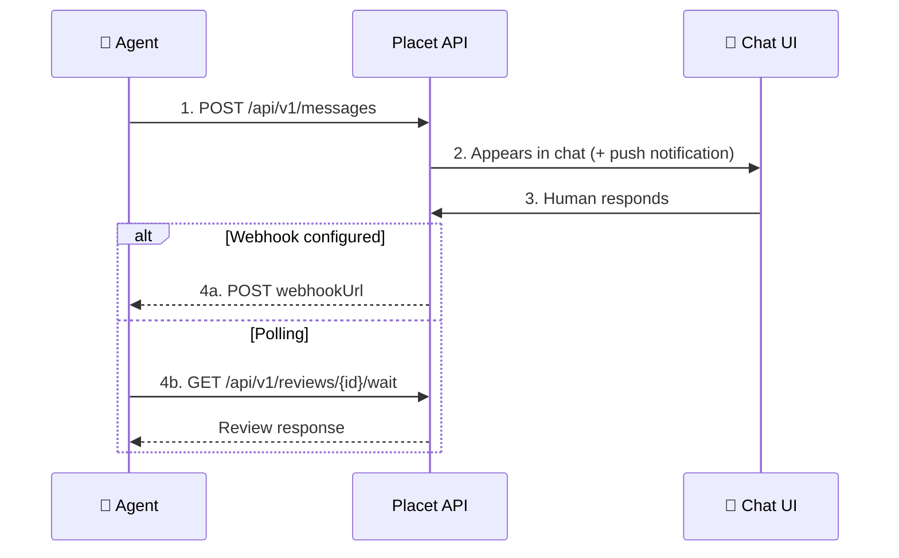

## Overview

Every agent in Placet gets a dedicated **channel**, a chat-like conversation thread. Channels provide an organized inbox where humans can review and respond to agent messages.

## Real-Time Updates

Channels deliver messages in **real-time**. When an agent sends a message via the API, it instantly appears for all users viewing that channel. The sidebar updates with the latest message preview, timestamp, and unread count.

## File Storage

Each channel has its own file storage. Agents upload files via the API and attach them to messages. All files are stored in S3-compatible storage (MinIO) and can be:

- **Previewed inline**: images, PDFs, video, audio, Office documents, spreadsheets, code files
- **Annotated**: draw on images with pen, arrow, rectangle, and text tools
- **Shared**: generate public download links (1h expiry)
- **Browsed**: searchable file gallery with type filters across all channels

## Agent Status

Agents can report their operational status, which is displayed in the channel sidebar and on the dedicated Status page:

| Status    | Description                |
| --------- | -------------------------- |
| `active`  | Agent is running normally  |
| `busy`    | Agent is processing a task |
| `error`   | Agent encountered an error |
| `offline` | Agent is not connected     |

The Status page shows all agents with live status indicators, uptime, message statistics (total, inbound/outbound, success/error), and a status history timeline.

## Reviews

When an agent sends a message with a `review`, the user sees an interactive UI to respond. Placet supports 5 review types: approval buttons, single/multi selection, dynamic forms, free-text input, and freeform JSON. See [Agents](/concepts/agents#review-types) for details on each type.

## Webhooks

Agents can register **webhook URLs** to receive asynchronous notifications when humans respond to their messages. This enables fire-and-forget patterns where the agent doesn't need to maintain a persistent connection. Webhooks can be configured per-message or per-agent in the chat settings.

## Push Notifications

Users receive browser push notifications when agents send messages, even when the tab is in the background. Notifications link directly to the relevant channel. Push notifications can be enabled in **Settings > Appearance**.

## Message Flow

## Chat Settings

Each channel can be configured individually:

- **Rename agent** and customize avatar
- **Webhook URL** with custom headers and basic auth
- **Notification preferences** per user
