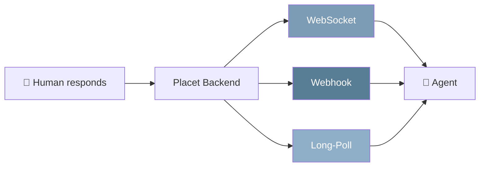
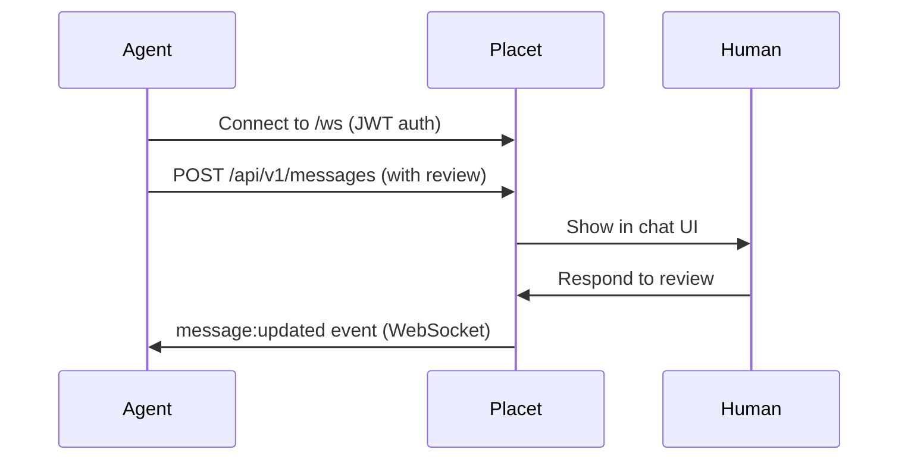
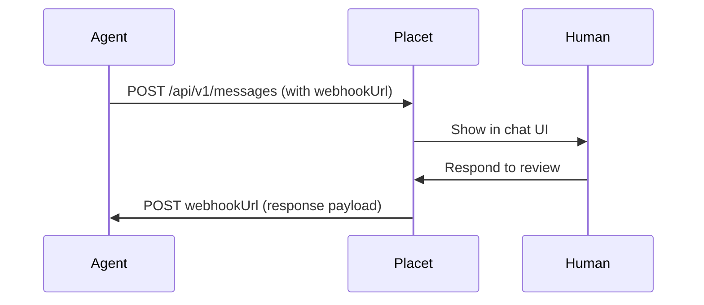
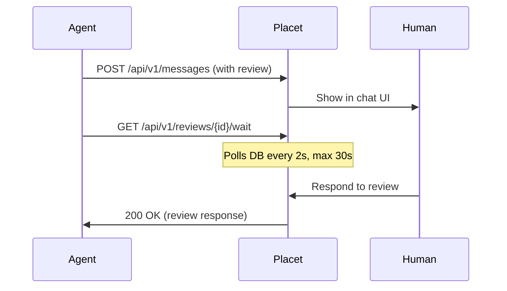

Placet supports three patterns for delivering human responses back to agents. You can use them independently or combine them.



## Comparison

| Feature                   | WebSocket           | Webhook                | Long-Polling   |
| ------------------------- | ------------------- | ---------------------- | -------------- |
| **Latency**               | Real-time           | Near real-time         | Up to 30s      |
| **Direction**             | Bidirectional       | Push to agent          | Agent pulls    |
| **Persistent connection** | Yes                 | No                     | No             |
| **Firewall-friendly**     | Requires WS support | Agent needs public URL | Yes            |
| **Best for**              | Interactive agents  | Background automations | Simple scripts |

---

## WebSocket

Real-time bidirectional communication via [Socket.IO](https://socket.io/) on the `/ws` namespace.

### How it works



### Events

| Event              | Direction       | Description                         |
| ------------------ | --------------- | ----------------------------------- |
| `message:created`  | Server → Client | New message in a subscribed channel |
| `review:responded` | Server → Client | Human completed a review            |
| `review:expired`   | Server → Client | Review expired (default: 24h)       |
| `message:delivery` | Server → Client | Delivery status changed             |
| `agent:status`     | Server → Client | Agent ping status changed           |

### Connection Example

```typescript
import { io } from 'socket.io-client';

const socket = io('https://your-placet-instance.com/ws', {
  auth: { token: 'your-jwt-token' },
});

socket.on('connect', () => {
  console.log('Connected to Placet WebSocket');
});

socket.on('review:responded', (data) => {
  console.log(`Review ${data.id} answered: ${data.review.response.selectedOption}`);
});

socket.on('message:created', (data) => {
  console.log(`New message: ${data.text}`);
});
```

<Note>
  WebSocket connections use **JWT authentication** (not API keys). This is primarily used by the
  frontend. For agent integrations, prefer webhooks or long-polling with API keys.
</Note>

---

## Webhooks

Receive HTTP callbacks when a human responds. No persistent connection required, Placet pushes to your endpoint.

### How it works



### Webhook Priority

Placet dispatches webhooks in a 3-tier priority order:

1. **Message-level `webhookUrl`**: set per message in the request body
2. **Agent-level `webhookUrl`**: configured on the agent in settings
3. **Legacy callback**: fallback for backward compatibility

The first matching webhook URL is used. If multiple tiers are configured, higher priority wins.

### Setting a Webhook

**Per message:**

```bash
curl -X POST "$PLACET_URL/api/v1/messages" \
  -H "Authorization: Bearer $PLACET_API_KEY" \
  -H "Content-Type: application/json" \
  -d '{
    "channelId": "your-agent-id",
    "text": "Approve deployment?",
    "webhookUrl": "https://your-server.com/webhook",
    "review": {
      "type": "approval",
      "payload": {
        "options": [
          {"id": "approve", "label": "Approve", "style": "primary"},
          {"id": "reject", "label": "Reject", "style": "danger"}
        ]
      }
    }
  }'
```

### Webhook Security

- **SSRF protection**: Placet validates webhook URLs against an allowlist and blocks private/internal IPs
- **Timeout**: Webhook requests have a 10-second timeout
- **Retries**: Failed deliveries can be retried via the UI retry button or the `POST /api/messages/{id}/retry` endpoint

<Warning>
  Your webhook endpoint must be publicly accessible. Placet blocks requests to private IP ranges
  (`10.x.x.x`, `172.16-31.x.x`, `192.168.x.x`, `127.x.x.x`) to prevent SSRF attacks.
</Warning>

---

## Long-Polling

The simplest pattern: your agent sends a request and waits for a response. No server infrastructure needed.

### How it works



### Usage

```bash
# 1. Send a message with a review
RESPONSE=$(curl -s -X POST "$PLACET_URL/api/v1/messages" \
  -H "Authorization: Bearer $PLACET_API_KEY" \
  -H "Content-Type: application/json" \
  -d '{
    "channelId": "your-agent-id",
    "text": "Continue processing?",
    "review": {
      "type": "approval",
      "payload": {
        "options": [
          {"id": "yes", "label": "Yes"},
          {"id": "no", "label": "No"}
        ]
      }
    }
  }')

MESSAGE_ID=$(echo "$RESPONSE" | jq -r '.id')

# 2. Long-poll for the response
curl -s "$PLACET_URL/api/v1/reviews/$MESSAGE_ID/wait?channel=your-agent-id&timeout=30000" \
  -H "Authorization: Bearer $PLACET_API_KEY"
```

### Parameters

| Parameter | Default    | Description                           |
| --------- | ---------- | ------------------------------------- |
| `channel` | _required_ | Agent/channel ID                      |
| `timeout` | `30000`    | Max wait time in ms (capped at 30000) |

### Response States

| `status`    | Meaning                                               |
| ----------- | ----------------------------------------------------- |
| `completed` | Human responded, `response` field contains the answer |
| `pending`   | Timeout reached, no response yet, retry the poll      |
| `expired`   | Review expired (default 24h), no response will come   |

<Tip>
  If the first poll returns `pending`, simply call the endpoint again. The review stays active until
  a human responds or it expires (default 24 hours, max 36 hours).
</Tip>

---

## Delivery Status

Placet tracks whether webhooks were delivered successfully and whether the agent acknowledged receipt. This provides WhatsApp-style delivery checkmarks in the UI.

### Status Values

| Status              | Icon      | Meaning                               |
| ------------------- | --------- | ------------------------------------- |
| `sent`              | ✓         | Message stored, webhook not yet sent  |
| `webhook_delivered` | ✓✓        | Webhook received 2xx response         |
| `webhook_failed`    | ✓ ❌      | Webhook delivery failed               |
| `agent_received`    | ✓✓ (blue) | Agent explicitly acknowledged receipt |

### Agent Acknowledgment

Agents can explicitly confirm they received and processed a message using the ACK endpoint:

```bash
curl -X POST "$PLACET_URL/api/v1/messages/$MESSAGE_ID/ack?channel=$AGENT_ID" \
  -H "Authorization: Bearer $PLACET_API_KEY"
```

This updates the delivery status to `agent_received` and notifies the frontend in real-time.

### Retry Failed Deliveries

When a webhook delivery fails, users see a retry button in the chat UI. This can also be triggered via API:

```bash
curl -X POST "$PLACET_URL/api/messages/$MESSAGE_ID/retry" \
  -H "Authorization: Bearer $JWT_TOKEN"
```

The retry re-sends the original webhook payload (either a `message:created` or `review:responded` event).

### WebSocket Events

The `message:delivery` event is emitted whenever delivery status changes:

```json
{
  "messageId": "msg_abc123",
  "deliveryStatus": "webhook_delivered"
}
```

---

## Choosing a Pattern

<AccordionGroup>
  <Accordion title="I'm building an interactive chat agent">
    Use **Long-Polling** with the `/api/v1/reviews/{id}/wait` endpoint. It's the simplest to implement and works from any environment. Send a message, poll for the response, then continue your logic.
  </Accordion>

<Accordion title="I'm running background automations (CI/CD, cron)">
  Use **Webhooks**. Set a `webhookUrl` on each message and let Placet push responses to your server.
  This way your automation doesn't block while waiting.
</Accordion>

<Accordion title="I'm building a web dashboard that shows live updates">
  Use **WebSocket**. Connect via Socket.IO and subscribe to real-time events. This is how the Placet
  frontend itself works.
</Accordion>

  <Accordion title="I just want to send notifications without waiting">
    Use **fire-and-forget**: simply `POST /api/v1/messages` without a `review` field. No need for any response mechanism. Users still receive push notifications and see the message in real-time.
  </Accordion>
</AccordionGroup>

---

## Push Notifications

In addition to the three agent-facing delivery patterns above, Placet sends **browser push notifications** to users when new messages arrive. This works independently of which pattern the agent uses: users receive a notification even when the browser tab is in the background or closed.

Push notifications are powered by the Web Push API (VAPID) and can be enabled per user in **Settings > Appearance**.
