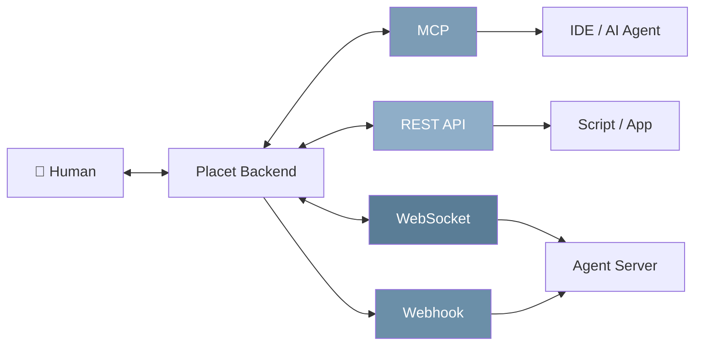

Placet supports four connection types for agent integration. You can use them independently or combine them.

## Comparison

| Feature                    | [MCP](/connections/mcp) | [REST API](/connections/rest-api) | [WebSocket](/connections/websocket) | [Webhooks](/connections/webhooks) |
| -------------------------- | ----------------------- | --------------------------------- | ----------------------------------- | --------------------------------- |
| **Best for**               | AI coding agents        | Scripts & apps                    | Persistent agents                   | Background jobs                   |
| **Latency**                | Real-time (poll)        | Up to 30s (poll)                  | Real-time (push)                    | Near real-time (push)             |
| **Persistent connection**  | Per-session             | No                                | Yes                                 | No                                |
| **Agent needs public URL** | No                      | No                                | No                                  | Yes                               |
| **Protocol**               | MCP over HTTP/stdio     | HTTP REST                         | Socket.IO                           | HTTP callback                     |

---

## Choosing a Connection

<AccordionGroup>
  <Accordion title="I'm using an AI coding agent (Claude Code, Copilot, Cursor)">
    Use **[MCP](/connections/mcp)**. The Placet MCP server exposes all capabilities as tools that AI assistants can call directly. Configure your IDE with a one-line config.
  </Accordion>

<Accordion title="I'm writing a script or simple integration">
  Use the **[REST API](/connections/rest-api)**. Send messages via HTTP, poll for responses with
  long-polling. Works from any language with zero dependencies.
</Accordion>

<Accordion title="I'm building a persistent agent that reacts in real-time">
  Use **[WebSocket](/connections/websocket)**. Connect via Socket.IO, subscribe to channels, and
  receive instant push events when humans respond.
</Accordion>

<Accordion title="I'm running background automations (CI/CD, cron)">
  Use **[Webhooks](/connections/webhooks)**. Set a webhook URL and let Placet push responses to your
  server — your automation doesn't block while waiting.
</Accordion>

  <Accordion title="I just want to send notifications without waiting">
    Use **fire-and-forget** via the [REST API](/connections/rest-api): `POST /api/v1/messages` without a `review` field. No response mechanism needed.
  </Accordion>
</AccordionGroup>

---

## Push Notifications

All connection types benefit from **browser push notifications**. When an agent sends a message, users receive a notification even when the browser tab is in the background. Push notifications are powered by the Web Push API (VAPID) and can be enabled per user in **Settings > Appearance**.
