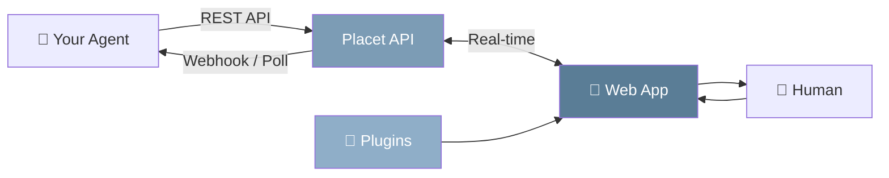
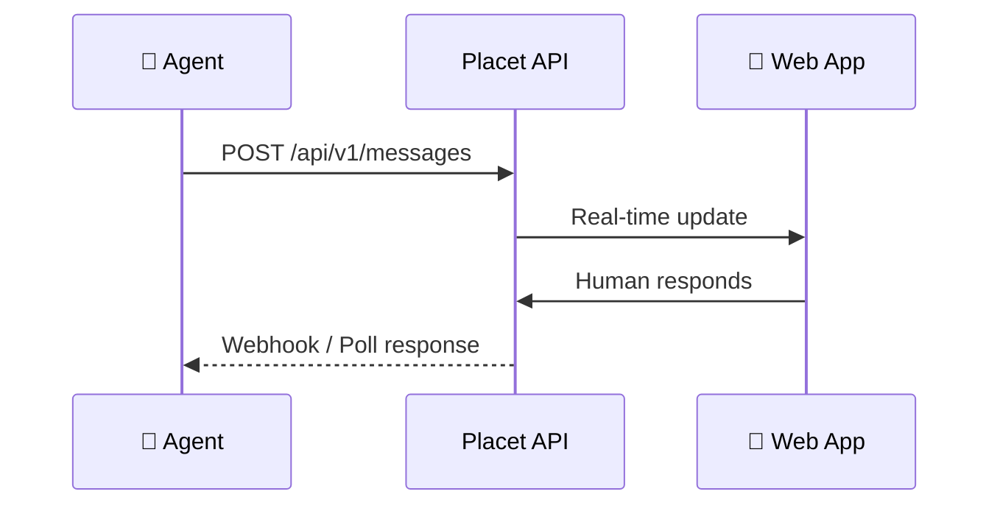

## Overview

Placet consists of three main components:

- **Web App**: the inbox where humans review and respond to messages
- **API**: the REST endpoint agents and automations use to send messages and receive responses
- **Plugin System**: extensible message rendering via sandboxed plugins

## Agent Communication

Agents interact with Placet through the **Agent API** (`/api/v1/*`), authenticated with API keys:

### Supported patterns

| Pattern           | Use Case                                                         |
| ----------------- | ---------------------------------------------------------------- |
| **Fire & forget** | Agent sends a message, no response needed                        |
| **Webhook**       | Agent registers a webhook URL, receives responses asynchronously |
| **Polling**       | Agent polls for review responses via the API                     |
| **WebSocket**     | Real-time bidirectional communication                            |

For a detailed comparison, see [Connection Types](/concepts/connection-types).

## Review System

Agents can request human input by attaching a `review` to any message. Placet supports 5 built-in review types:

| Type         | Agent sends                                | User sees                              |
| ------------ | ------------------------------------------ | -------------------------------------- |
| **Approval** | `options: [{id, label, style}]`            | Styled buttons with optional comment   |
| **Selection**| `mode: "single"\|"multi", items: [...]`    | Radio buttons or checkboxes            |
| **Form**     | `fields: [{name, type, label, required}]`  | Dynamic form (12 field types)          |
| **Text Input** | `placeholder?, markdown?`                | Textarea with optional markdown        |
| **Freeform** | `{}`                                       | JSON editor (for plugin UIs)           |

Reviews support expiry (default 24h, max 36h), webhook callbacks, and long-polling. See [Agents](/concepts/agents) for payload examples.

## File Storage

Agents can upload and attach files to messages via the API. The web app renders inline previews for many formats:

| Category       | Formats                                      |
| -------------- | -------------------------------------------- |
| **Images**     | JPG, PNG, GIF, WebP, SVG                     |
| **Video**      | MP4, WebM, MOV                               |
| **Audio**      | MP3, WAV, OGG, M4A                           |
| **Documents**  | PDF, DOCX, ODT                               |
| **Spreadsheets** | XLSX, XLS, ODS, CSV                        |
| **Presentations** | PPTX                                      |
| **Code**       | 40+ languages with syntax highlighting       |
| **Markdown**   | Rendered with GFM support                    |

Additional file features:
- **Canvas annotations**: draw on images with pen, arrow, rectangle, and text tools
- **Share links**: JWT-based public download links (1h expiry)
- **Bulk operations**: download as ZIP or delete multiple files
- **File browser**: searchable gallery with type filters across all channels

## Agent Status

Agents report their status via a heartbeat endpoint (`POST /api/v1/status/ping`). The frontend provides a dedicated **Status** page showing all agents with:

- Live status indicator (active, busy, error, offline)
- Uptime since last status change
- Message statistics (total, inbound/outbound, success/error)
- Status history timeline

## Push Notifications

Placet supports browser push notifications via VAPID/Web Push. When an agent sends a message, users receive a notification even when the browser tab is in the background. Clicking the notification navigates directly to the agent's chat.
