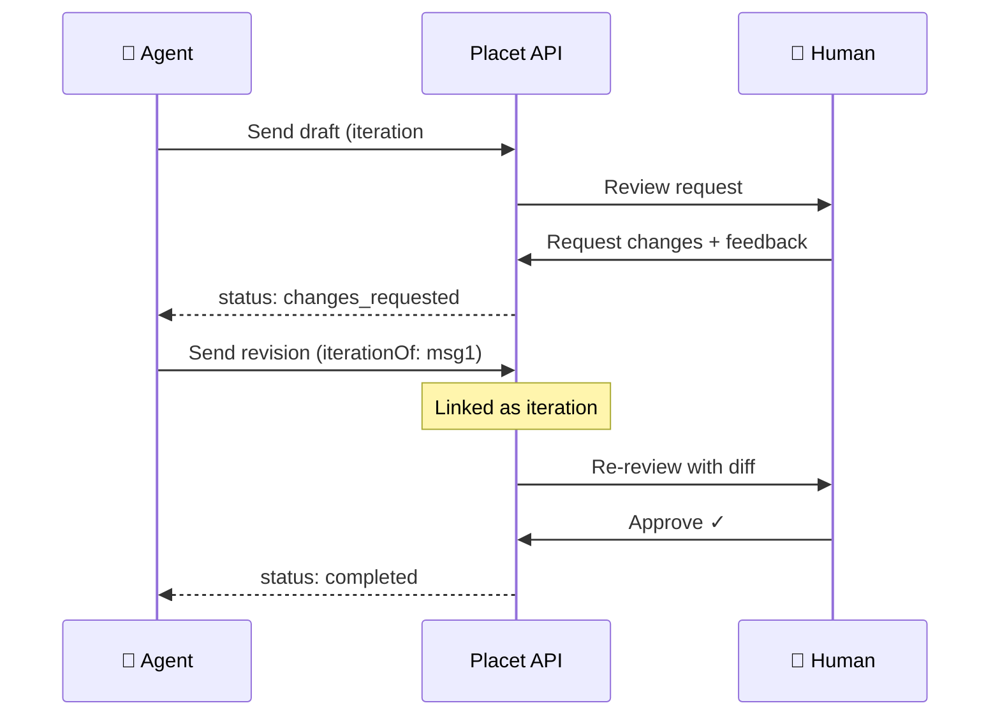
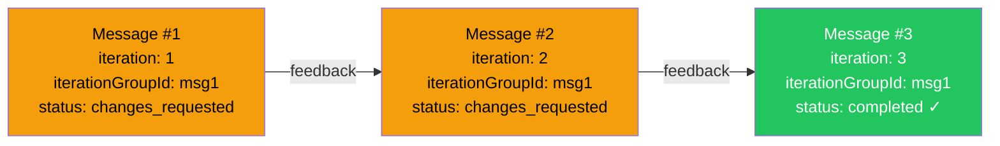
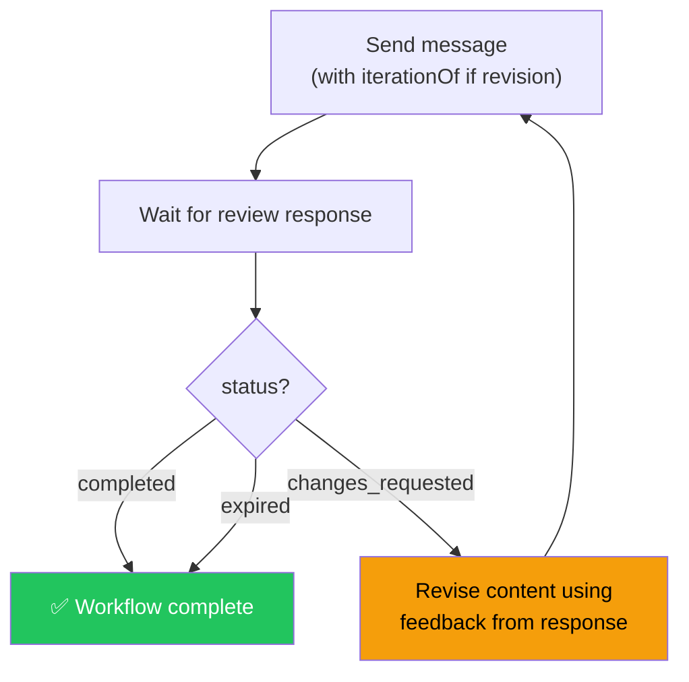
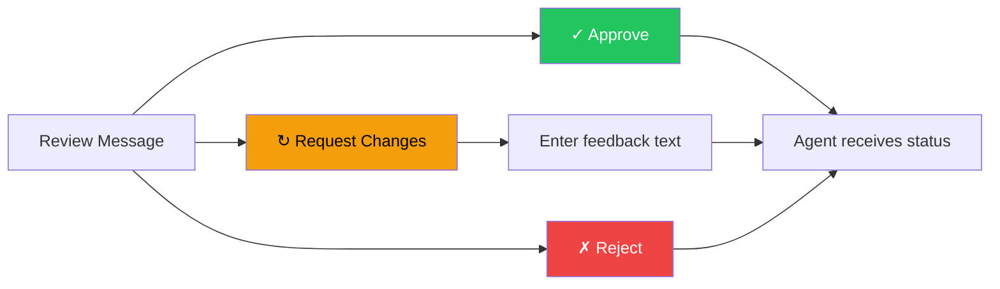
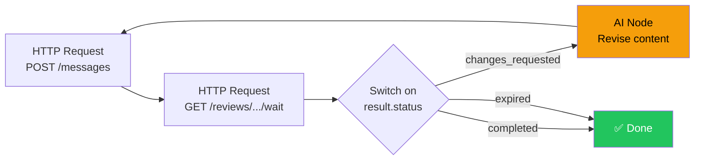

## Overview

Placet's **iteration system** turns one-shot reviews into multi-round revision workflows. An agent sends content, a human provides feedback, the agent revises, and the human reviews again — as many rounds as needed.

All iterations of the same task are linked into an **iteration chain**, enabling diff views, feedback history, and progress tracking across revisions.



## When to Use Iterations

| Scenario               | Without iterations                          | With iterations                                |
| ---------------------- | ------------------------------------------- | ---------------------------------------------- |
| **Content generation** | Agent sends once, human approves or rejects | Human requests specific changes, agent revises |
| **Report review**      | Binary approve/reject, agent starts over    | Feedback loop until quality met                |
| **Code review**        | Human re-explains issues each time          | Previous feedback visible in context           |
| **Image generation**   | No connection between attempts              | Side-by-side comparison with previous version  |

## How It Works

### Data Model

Iterations are tracked with two fields on the `Message` model — no new tables:

| Field              | Type      | Description                                                                    |
| ------------------ | --------- | ------------------------------------------------------------------------------ |
| `iterationGroupId` | `string?` | Points to the root message ID of the chain. `null` for standalone messages.    |
| `iteration`        | `int?`    | Counter within the group. `1` = root, `2`+ = revisions. `null` for standalone. |

A unique constraint on `(iterationGroupId, iteration)` prevents race conditions.



### Review Statuses

| Status              | Meaning                  | Wait endpoint behavior |
| ------------------- | ------------------------ | ---------------------- |
| `pending`           | Awaiting human response  | Continues polling      |
| `completed`         | Human approved/submitted | Returns immediately    |
| `changes_requested` | Human wants revisions    | Returns immediately    |
| `expired`           | Timed out (default 24h)  | Returns immediately    |

<Note>
  `changes_requested` is a **terminal status** — the review does not expire. The agent must send a
  new iteration to continue the workflow.
</Note>

## Sending Iterations

### Step 1: Send the initial message

Send a message with a review as usual. No special parameters needed — the first message becomes the chain root automatically when an iteration references it.

```json
POST /api/v1/messages
{
  "channelId": "agent-123",
  "text": "Here is the Q1 report draft.\n\n- Revenue: $1.2M\n- Growth: 15%",
  "status": "warning",
  "metadata": { "runId": "run-001", "model": "gpt-4" },
  "review": {
    "type": "approval",
    "payload": {
      "options": [
        { "id": "approve", "label": "Approve", "style": "primary" },
        { "id": "reject", "label": "Reject", "style": "danger" }
      ]
    }
  }
}
```

### Step 2: Wait for the response

Use the wait endpoint to poll for the human's decision:

```json
GET /api/v1/reviews/{messageId}/wait?channel=agent-123&timeout=120000
```

The response includes the new `changes_requested` status:

```json
{
  "status": "changes_requested",
  "message": {
    "id": "msg-1",
    "review": {
      "status": "changes_requested",
      "feedback": "Please add Q2 projections and fix the growth calculation.",
      "response": { "selectedOption": "reject" }
    }
  }
}
```

### Step 3: Send a revised iteration

Reference the previous message via `iterationOf` to create an iteration chain:

```json
POST /api/v1/messages
{
  "channelId": "agent-123",
  "text": "Revised Q1 report with Q2 projections.\n\n- Revenue: $1.2M\n- Growth: 18% (corrected)\n- Q2 Projection: $1.4M",
  "status": "warning",
  "metadata": { "runId": "run-002", "model": "gpt-4" },
  "iterationOf": "msg-1",
  "review": {
    "type": "approval",
    "payload": {
      "options": [
        { "id": "approve", "label": "Approve", "style": "primary" },
        { "id": "reject", "label": "Reject", "style": "danger" }
      ]
    }
  }
}
```

The response includes the iteration metadata:

```json
{
  "id": "msg-2",
  "iterationGroupId": "msg-1",
  "iteration": 2,
  "text": "Revised Q1 report with Q2 projections...",
  ...
}
```

### Step 4: Repeat until approved

Continue the loop — check the wait endpoint, and if `changes_requested`, send another iteration:



## Requesting Changes (Human Side)

When reviewing a message, humans have three options:

1. **Approve** — completes the review (`status: completed`)
2. **Request Changes** — sends feedback to the agent (`status: changes_requested`)
3. **Reject** — completes the review with rejection (`status: completed`)

The "Request Changes" action opens a feedback text field. The feedback is stored in the review and delivered to the agent via webhook, WebSocket, or the wait endpoint.



<Tip>
  The "Request Changes" button appears on all review types. Feedback text is optional but
  recommended — it gives the agent context for the revision.
</Tip>

## Retrieving Iteration Chains

### Agent API

```bash
GET /api/v1/messages/iterations/{messageId}?channel={channelId}
```

### Response

```json
{
  "groupId": "msg-1",
  "iterations": [
    {
      "id": "msg-1",
      "iteration": 1,
      "text": "Draft report v1...",
      "review": { "status": "changes_requested", "feedback": "Add Q2 data" }
    },
    {
      "id": "msg-2",
      "iteration": 2,
      "text": "Revised report with Q2...",
      "review": { "status": "completed", "response": { "selectedOption": "approve" } }
    }
  ]
}
```

You can pass **any message ID** from the chain — the API returns the complete chain sorted by iteration number.

## Validation Rules

The `iterationOf` parameter is validated by the backend:

| Rule                                                     | Error                                                  |
| -------------------------------------------------------- | ------------------------------------------------------ |
| Target message must exist                                | `400 Bad Request`                                      |
| Target must be in the same channel                       | `400 Bad Request`                                      |
| Target review must be `completed` or `changes_requested` | `400 Bad Request` — cannot iterate on a pending review |

<Warning>
  Messages in an iteration chain cannot be deleted while other messages reference the same group.
  This protects the integrity of the chain.
</Warning>

## Diff & Comparison Views

When iterations exist, the web app automatically shows what changed between versions:

- **Text diff** — inline additions (green) and deletions (red) between iterations
- **Image comparison** — side-by-side view of previous and current image attachments
- **Iteration breadcrumbs** — clickable `① → ② → ③` navigation with status indicators
- **Previous feedback** — the feedback from the last iteration is displayed for context

These views appear in the chat detail view, file preview modal, and the inbox detail.

## Inbox Integration

The inbox is iteration-aware:

- **Re-Review badge** — messages that are iteration #2+ show a "Re-Review" tag
- **Changes badge** — messages with `changes_requested` status show an orange indicator
- **Iteration breadcrumbs** — navigate between iterations directly from the inbox detail
- **Diff toggle** — compare the current iteration with the previous one
- **Pending reviews bar** — floating bar at the top of chat showing open reviews, with iteration chains grouped

## Webhook Events

When a human requests changes, a webhook is delivered with:

```json
{
  "event": "review:changes_requested",
  "messageId": "msg-1",
  "channelId": "agent-123",
  "iteration": 1,
  "iterationGroupId": "msg-1",
  "feedback": "Please add Q2 projections.",
  "review": { ... }
}
```

## MCP Server Tools

The MCP server exposes iteration support through enhanced tools:

| Tool                  | Iteration support                                     |
| --------------------- | ----------------------------------------------------- |
| `send_message`        | `iterationOf` parameter to chain messages             |
| `send_review_message` | `iterationOf` parameter to chain review messages      |
| `wait_for_review`     | Returns `changes_requested` immediately with feedback |
| `get_iteration_chain` | New tool — fetch all iterations for a message         |

## Agent Loop Pattern

A typical agent implementation handles iterations with a simple loop:

<CodeGroup>
```python Python
import requests, time

def run_agent(channel, api_key):
session = requests.Session()
session.headers["x-api-key"] = api_key
base = "http://localhost:3001"

    iteration_of = None
    content = generate_initial_content()

    while True:
        body = {
            "channelId": channel,
            "text": content,
            "metadata": {"generatedAt": time.time()},
            "review": {
                "type": "approval",
                "payload": {"options": [
                    {"id": "approve", "label": "Approve"},
                    {"id": "reject", "label": "Reject"},
                ]},
            },
        }
        if iteration_of:
            body["iterationOf"] = iteration_of

        msg = session.post(f"{base}/api/v1/messages", json=body).json()

        result = session.get(
            f"{base}/api/v1/reviews/{msg['id']}/wait",
            params={"channel": channel, "timeout": "120000"},
        ).json()

        if result["status"] == "changes_requested":
            feedback = result["message"]["review"].get("feedback", "")
            content = revise_content(content, feedback)
            iteration_of = msg["id"]
            continue  # next iteration

        break  # approved, expired, or completed

````

```typescript TypeScript
async function runAgent(channel: string, apiKey: string) {
  const base = "http://localhost:3001";
  const headers = { "x-api-key": apiKey, "Content-Type": "application/json" };

  let iterationOf: string | undefined;
  let content = generateInitialContent();

  while (true) {
    const body: Record<string, unknown> = {
      channelId: channel,
      text: content,
      metadata: { generatedAt: Date.now() },
      review: {
        type: "approval",
        payload: { options: [
          { id: "approve", label: "Approve" },
          { id: "reject", label: "Reject" },
        ]},
      },
    };
    if (iterationOf) body.iterationOf = iterationOf;

    const msg = await fetch(`${base}/api/v1/messages`, {
      method: "POST", headers, body: JSON.stringify(body),
    }).then(r => r.json());

    const result = await fetch(
      `${base}/api/v1/reviews/${msg.id}/wait?channel=${channel}&timeout=120000`,
      { headers },
    ).then(r => r.json());

    if (result.status === "changes_requested") {
      const feedback = result.message?.review?.feedback ?? "";
      content = reviseContent(content, feedback);
      iterationOf = msg.id;
      continue; // next iteration
    }

    break; // approved, expired, or completed
  }
}
````

</CodeGroup>

## Using Metadata for Agent Context

The `metadata` field on messages is a free-form JSON object that the agent controls. Placet stores it unchanged and returns it in all API responses. Use it to track agent-specific context across iterations:

```json
{
  "metadata": {
    "runId": "run-abc-123",
    "model": "gpt-4",
    "promptVersion": "v2.1",
    "tokensUsed": 1847,
    "previousFeedback": ["Add Q2 data", "Fix growth %"]
  }
}
```

<Tip>
  Store your agent's run context in `metadata` so you can reconstruct state when processing
  `changes_requested`. The system never reads or modifies this field.
</Tip>

## n8n / Automation Workflow Pattern

For workflow automation tools like n8n, implement the iteration loop using a **Switch node** after the wait step:



The key is the loop back from the Switch node to the Send node, passing the previous message ID as `iterationOf` and incorporating the feedback from the response.
