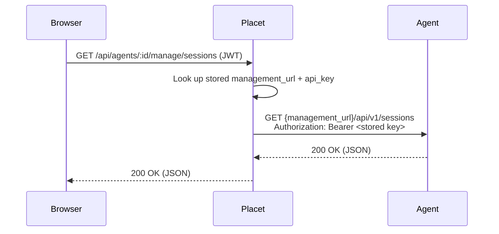

Placet's **Agent Management Dashboard** is an optional UI that lets a user inspect and control a connected agent runtime (sessions, audit logs, token usage, credentials, cron, MCP bridges, workspace, skills, scripts, channels, commands, agent card, A2A peers) directly from Placet — without ever exposing the agent's bearer token to the browser.

The protocol Placet speaks upstream is the **facio management API** (`/api/v1/*`, bearer-authenticated). Any agent runtime that implements the same surface — or a compatible subset — can be connected; references to facio below describe the wire contract, not an implementation dependency.

The dashboard is **off by default** per user. It becomes visible once a user enables it under **Settings → Preferences → Management Dashboard**. Placet auto-enables this preference the first time a user registers an agent that provides management credentials.



Placet owns a dedicated, typed endpoint for every upstream management route — it is **not** a generic wildcard proxy. Controllers are explicit to give the backend room for caching, cross-agent aggregation, and request shaping. When the upstream is unreachable Placet returns `502 Bad Gateway` and the frontend silently hides the view.

---

## Registering Management Credentials

An agent registers management credentials the same way it registers a channel — by calling `POST /api/v1/agents/setWebhook` on the Placet backend with the additional `management` object, or by using the dedicated `setManagement` endpoint.

### Option A — Combined with `setWebhook`

```http
POST /api/v1/agents/setWebhook
x-api-key: <placet-agent-key>
Content-Type: application/json
```

```json
{
  "channelId": "my-agent-id",
  "webhookUrl": "https://agent.example.com/placet/webhook",
  "management": {
    "url": "https://agent.example.com",
    "apiKey": "management-bearer-token"
  },
  "isSubagent": false,
  "parentChannelId": null
}
```

| Field              | Type              | Description                                                                                       |
| ------------------ | ----------------- | ------------------------------------------------------------------------------------------------- |
| `management.url`   | `string` (URL)    | Base URL of the agent runtime (`/api/v1` is appended automatically).                              |
| `management.apiKey`| `string`          | Management bearer token. Stored encrypted, returned as `***` to the UI.                           |
| `isSubagent`       | `boolean`         | `true` marks this channel as a HITL sub-channel that should be hidden from the agent list.       |
| `parentChannelId`  | `string \| null`  | When `isSubagent` is `true`, the `channelId` of the parent agent owning this HITL channel.        |

### Option B — Dedicated endpoint

```http
POST /api/v1/agents/setManagement
x-api-key: <placet-agent-key>
Content-Type: application/json
```

```json
{
  "channelId": "my-agent-id",
  "url": "https://agent.example.com",
  "apiKey": "management-bearer-token"
}
```

Pass `"url": null, "apiKey": null` to **clear** the management credentials for a channel.

---

## Endpoints

Every endpoint listed below lives under `/api/agents/:agentId/manage/` on the Placet backend and maps 1:1 to the upstream `/api/v1/` route. All requests require a valid Placet user JWT (`Authorization: Bearer <jwt>`) and are scoped to the authenticated user's agent.

### Health

| Method | Placet path | Upstream route    | Description               |
| ------ | ----------- | -------------- | ------------------------- |
| GET    | `/health`   | `/health`      | Management liveness check |

### Sessions

| Method | Placet path        | Upstream route        | Description                     |
| ------ | ------------------ | ------------------ | ------------------------------- |
| GET    | `/sessions`        | `/sessions`        | List sessions (metadata only)   |
| GET    | `/sessions/{key}`  | `/sessions/{key}`  | Full history for a session key  |
| DELETE | `/sessions/{key}`  | `/sessions/{key}`  | Remove a session (cache + file) |

### Audit log

| Method | Placet path              | Upstream route              | Description                      |
| ------ | ------------------------ | ------------------------ | -------------------------------- |
| GET    | `/audit`                 | `/audit`                 | Filtered event list              |
| GET    | `/audit/tail`            | `/audit/tail`            | Last N events from today         |
| GET    | `/audit/stats`           | `/audit/stats`           | Aggregated event counts          |
| GET    | `/audit/runs/{runId}`    | `/audit/runs/{runId}`    | All events for a single run      |

### Token usage

| Method | Placet path          | Upstream route          | Description                       |
| ------ | -------------------- | -------------------- | --------------------------------- |
| GET    | `/usage`             | `/usage`             | Aggregated totals + grouped items |
| GET    | `/usage/runs/{runId}`| `/usage/runs/{runId}`| Single-turn token-usage row       |

### Credentials

| Method | Placet path            | Upstream route            | Description                 |
| ------ | ---------------------- | ---------------------- | --------------------------- |
| GET    | `/credentials`         | `/credentials`         | List keys (values masked)   |
| GET    | `/credentials/{key}`   | `/credentials/{key}`   | Existence check             |
| PUT    | `/credentials/{key}`   | `/credentials/{key}`   | Upsert (`{"value": "..."}`) |
| DELETE | `/credentials/{key}`   | `/credentials/{key}`   | Remove                      |

### Cron

| Method | Placet path           | Upstream route           | Description          |
| ------ | --------------------- | --------------------- | -------------------- |
| GET    | `/cron`               | `/cron`               | List jobs            |
| POST   | `/cron`               | `/cron`               | Create               |
| GET    | `/cron/{id}`          | `/cron/{id}`          | Get single job       |
| PATCH  | `/cron/{id}`          | `/cron/{id}`          | Partial update       |
| DELETE | `/cron/{id}`          | `/cron/{id}`          | Remove               |
| POST   | `/cron/{id}/run-now`  | `/cron/{id}/run-now`  | Trigger immediately  |
| POST   | `/cron/{id}/pause`    | `/cron/{id}/pause`    | Disable              |
| POST   | `/cron/{id}/resume`   | `/cron/{id}/resume`   | Enable               |

### MCP servers

| Method | Placet path            | Upstream route            | Description           |
| ------ | ---------------------- | ---------------------- | --------------------- |
| GET    | `/mcp`                 | `/mcp`                 | List servers          |
| POST   | `/mcp`                 | `/mcp`                 | Add a server          |
| GET    | `/mcp/{name}`          | `/mcp/{name}`          | Get single server     |
| PATCH  | `/mcp/{name}`          | `/mcp/{name}`          | Edit config           |
| DELETE | `/mcp/{name}`          | `/mcp/{name}`          | Remove                |
| POST   | `/mcp/{name}/enable`   | `/mcp/{name}/enable`   | Enable + connect      |
| POST   | `/mcp/{name}/disable`  | `/mcp/{name}/disable`  | Disable + disconnect  |
| POST   | `/mcp/{name}/restart`  | `/mcp/{name}/restart`  | Reconnect             |

### Workspace

| Method | Placet path           | Upstream route           | Description                          |
| ------ | --------------------- | --------------------- | ------------------------------------ |
| GET    | `/workspace/tree`     | `/workspace/tree`     | Directory listing (`?path=&depth=`)  |
| GET    | `/workspace/file`     | `/workspace/file`     | Read file contents (`?path=`)        |
| PUT    | `/workspace/file`     | `/workspace/file`     | Write file contents (`?path=`)       |
| DELETE | `/workspace/file`     | `/workspace/file`     | Delete file (`?path=`)               |

### Skills & scripts

| Method | Placet path     | Upstream route     | Description                   |
| ------ | --------------- | --------------- | ----------------------------- |
| GET    | `/skills`       | `/skills`       | List workspace `skills/*.md`  |
| GET    | `/scripts`      | `/scripts`      | List workspace `scripts/*`    |

### Channels

| Method | Placet path           | Upstream route           | Description                              |
| ------ | --------------------- | --------------------- | ---------------------------------------- |
| GET    | `/channels`           | `/channels`           | List channel configs                     |
| GET    | `/channels/{name}`    | `/channels/{name}`    | Get channel config                       |
| PUT    | `/channels/{name}`    | `/channels/{name}`    | Upsert channel config (restart required) |
| DELETE | `/channels/{name}`    | `/channels/{name}`    | Remove channel config (restart required) |

### Commands

| Method | Placet path          | Upstream route          | Description          |
| ------ | -------------------- | -------------------- | -------------------- |
| POST   | `/commands/stop`     | `/commands/stop`     | Execute `/stop`      |
| POST   | `/commands/restart`  | `/commands/restart`  | Execute `/restart`   |
| POST   | `/commands/new`      | `/commands/new`      | Execute `/new`       |
| POST   | `/commands/dream`    | `/commands/dream`    | Execute `/dream`     |
| GET    | `/commands/status`   | `/commands/status`   | Execute `/status`    |

### Agent Card

| Method | Placet path     | Upstream route     | Description                 |
| ------ | --------------- | --------------- | --------------------------- |
| GET    | `/agent-card`   | `/agent-card`   | Live A2A AgentCard JSON     |

### A2A peers

| Method | Placet path                   | Upstream route                   | Description                       |
| ------ | ----------------------------- | ----------------------------- | --------------------------------- |
| GET    | `/a2a/peers`                  | `/a2a/peers`                  | List registered peers             |
| POST   | `/a2a/peers`                  | `/a2a/peers`                  | Register / overwrite a peer       |
| DELETE | `/a2a/peers/{alias}`          | `/a2a/peers/{alias}`          | Remove a peer                     |
| GET    | `/a2a/peers/{alias}/card`     | `/a2a/peers/{alias}/card`     | Fetch the peer Agent Card         |
| POST   | `/a2a/peers/{alias}/call`     | `/a2a/peers/{alias}/call`     | Send a message through the peer   |

### Error semantics

| Status | Meaning                                                                                        |
| ------ | ---------------------------------------------------------------------------------------------- |
| `401`  | Missing/invalid Placet JWT.                                                                    |
| `404`  | Agent has no management credentials configured.                                                |
| `502`  | Upstream timed out (15 s) or is unreachable. The frontend hides the dashboard silently.        |
| other  | Upstream status + body are forwarded verbatim.                                                 |

---

## Minimal Upstream Requirements

To support the management dashboard, your agent runtime **must**:

1. Expose a bearer-authenticated management API on `/api/v1/*` that matches the facio management wire contract — see [facio `AUTH.md`](https://github.com/placet-io/facio/blob/main/docs/) for the reference implementation.
2. Implement any subset of the routes above that you want users to see; unsupported ones simply return `404`, which the dashboard handles gracefully.
3. Accept a long-lived management bearer token that you can transmit to Placet via `setWebhook`/`setManagement`.

If a domain (e.g. `cron`, `mcp`) isn't supported by your runtime, the Placet UI tab for that feature stays empty — there is nothing else you need to do to "opt out".

---

## Security Notes

- Management keys are stored alongside webhook secrets and returned as `***` on every agent read.
- Only the agent owner (owner of the `apiKey` that registered the channel) can call `/manage/*` for that agent.
- Rotate a key by calling `setManagement` again; to revoke, set both fields to `null`.
