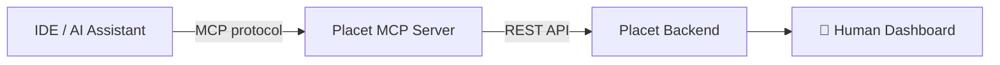
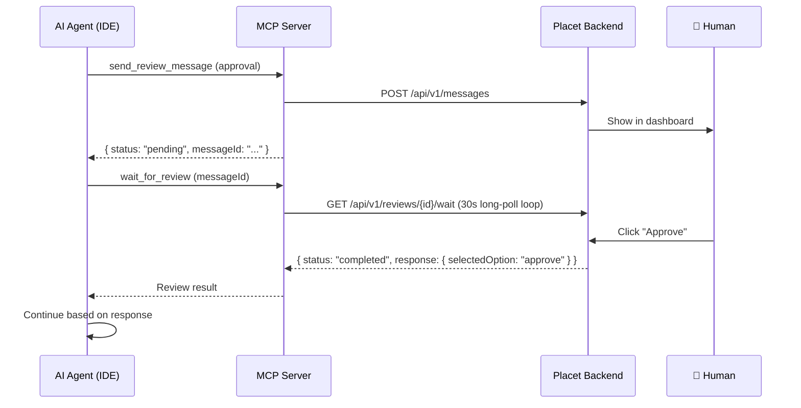

The [Model Context Protocol](https://modelcontextprotocol.io/) (MCP) is an open standard that lets AI assistants use external tools.
Placet ships an MCP server (`@placet/mcp`) that exposes all Placet capabilities — sending messages, requesting human reviews, rendering diagrams, and more — as MCP tools.

This is the recommended connection type when your agent runs inside an **AI-powered IDE or coding assistant** like Claude Code, VS Code Copilot, Cursor, or Windsurf.



## Transport Modes

The MCP server supports two transport modes:

| Mode                         | Use Case                               | Auth                           |
| ---------------------------- | -------------------------------------- | ------------------------------ |
| **StreamableHTTP** (default) | Remote/Docker deployment, multi-client | `x-api-key` header per request |
| **stdio**                    | Local development, single client       | `PLACET_API_KEY` env var       |

---

## Setup

### Docker (recommended)

The MCP server is included in the default `docker-compose.yml`:

```yaml
mcp-server:
  container_name: placet-mcp-server
  build:
    context: .
    dockerfile: packages/mcp-server/Dockerfile
  environment:
    PLACET_API_URL: http://backend:3001
    MCP_PORT: 3002
  ports:
    - '3002:3002'
```

Start it alongside the rest of Placet:

```bash
docker compose up -d
```

### npx (local / stdio)

For local development or one-off usage:

```bash
PLACET_API_URL=http://localhost:3001 \
PLACET_API_KEY=hp_your-api-key \
npx @placet/mcp --stdio
```

---

## Client Configuration

### VS Code / GitHub Copilot

Create `.vscode/mcp.json` in your project:

```json
{
  "servers": {
    "placet": {
      "type": "http",
      "url": "http://localhost:3002/mcp",
      "headers": {
        "x-api-key": "hp_your-api-key"
      }
    }
  }
}
```

### Claude Code

```bash
claude mcp add placet \
  --transport http \
  --url http://localhost:3002/mcp \
  --header "x-api-key: hp_your-api-key"
```

Or add to `~/.claude/claude_desktop_config.json`:

```json
{
  "mcpServers": {
    "placet": {
      "command": "npx",
      "args": ["@placet/mcp", "--stdio"],
      "env": {
        "PLACET_API_URL": "http://localhost:3001",
        "PLACET_API_KEY": "hp_your-api-key"
      }
    }
  }
}
```

### Cursor

Add to Cursor settings (`Settings > MCP Servers`):

```json
{
  "placet": {
    "url": "http://localhost:3002/mcp",
    "headers": {
      "x-api-key": "hp_your-api-key"
    }
  }
}
```

### Windsurf

Add to `~/.codeium/windsurf/mcp_config.json`:

```json
{
  "mcpServers": {
    "placet": {
      "serverUrl": "http://localhost:3002/mcp",
      "headers": {
        "x-api-key": "hp_your-api-key"
      }
    }
  }
}
```

### Any stdio-compatible client

For clients that support stdio transport:

```json
{
  "mcpServers": {
    "placet": {
      "command": "npx",
      "args": ["@placet/mcp", "--stdio"],
      "env": {
        "PLACET_API_URL": "http://localhost:3001",
        "PLACET_API_KEY": "hp_your-api-key",
        "PLACET_DEFAULT_CHANNEL": "your-channel-id"
      }
    }
  }
}
```

<Tip>
  Set `PLACET_DEFAULT_CHANNEL` to make the `channelId` parameter optional in all tools. This is
  useful when your agent only works with a single channel.
</Tip>

---

## Available Tools

### Channel Management

| Tool             | Description                                                           |
| ---------------- | --------------------------------------------------------------------- |
| `list_channels`  | List all channels accessible by the API key                           |
| `create_channel` | Create a new channel with name, description, and optional webhook URL |

### Messages

| Tool             | Description                                                                                                       |
| ---------------- | ----------------------------------------------------------------------------------------------------------------- |
| `send_message`   | Send an informational message with markdown and optional status indicator (`info`, `success`, `warning`, `error`) |
| `get_messages`   | List messages with pagination, search, and filtering                                                              |
| `get_message`    | Get a single message including review status and attachments                                                      |
| `delete_message` | Delete (retract) a message                                                                                        |

### Reviews (Human-in-the-Loop)

| Tool                  | Description                                                                              |
| --------------------- | ---------------------------------------------------------------------------------------- |
| `send_review_message` | Send a message that requires human interaction (see [review types](#review-types) below) |
| `wait_for_review`     | Long-poll for a human response (default 5 min, retryable)                                |
| `get_pending_reviews` | List all pending reviews in a channel                                                    |

### Status

| Tool          | Description                                                         |
| ------------- | ------------------------------------------------------------------- |
| `ping_status` | Report agent heartbeat — shown as online indicator in the dashboard |

### Plugins

| Tool           | Description                                       |
| -------------- | ------------------------------------------------- |
| `list_plugins` | List all installed plugins and their capabilities |

Plugin tools are **registered dynamically** at startup. The MCP server fetches all installed plugin manifests from the backend and creates a `send_{plugin_name}_message` tool for each plugin that has an `inputSchema`. See [Dynamic Plugin Tools](#dynamic-plugin-tools) below.

---

## Review Types

The `send_review_message` tool supports 5 review types. The AI agent sends the review, and a human responds in the Placet dashboard.

### Approval

Show buttons for the human to approve or reject an action.

```json
{
  "reviewType": "approval",
  "reviewPayload": {
    "options": [
      { "id": "approve", "label": "Approve", "style": "primary" },
      { "id": "reject", "label": "Reject", "style": "danger" }
    ],
    "allowComment": true
  }
}
```

**Button styles**: `primary` (green), `danger` (red), `secondary` (gray), `ghost` (outline)

**Response**: `{ "selectedOption": "approve", "comment": "Looks good!" }`

### Selection

Let the human choose from a list of options.

```json
{
  "reviewType": "selection",
  "reviewPayload": {
    "mode": "single",
    "items": [
      { "id": "opt-a", "label": "Option A", "description": "First choice" },
      { "id": "opt-b", "label": "Option B", "description": "Second choice" }
    ]
  }
}
```

Set `mode` to `"multi"` to allow selecting multiple items.

**Response**: `{ "selectedIds": ["opt-a"] }`

### Form

Render a structured form with typed fields.

```json
{
  "reviewType": "form",
  "reviewPayload": {
    "fields": [
      { "name": "serverName", "type": "text", "label": "Server Name", "required": true },
      {
        "name": "region",
        "type": "select",
        "label": "Region",
        "options": [
          { "value": "eu-west-1", "label": "EU West" },
          { "value": "us-east-1", "label": "US East" }
        ]
      },
      { "name": "instances", "type": "number", "label": "Instances", "min": 1, "max": 10 },
      { "name": "enableSSL", "type": "checkbox", "label": "Enable SSL", "defaultValue": true },
      { "name": "goLive", "type": "date", "label": "Go-Live Date" },
      { "name": "notes", "type": "textarea", "label": "Notes", "placeholder": "Any details..." }
    ],
    "submitLabel": "Deploy"
  }
}
```

**Supported field types**: `text`, `number`, `email`, `url`, `textarea`, `select`, `checkbox`, `date`, `time`, `datetime`, `range`, `password`

**Field options**: `required`, `placeholder`, `defaultValue`, `min`, `max`, `step`, `unit`, `options` (for `select`)

**Response**: `{ "serverName": "prod-api-02", "region": "eu-west-1", "instances": 3, "enableSSL": true, ... }`

### Text Input

Free text input, optionally with a markdown editor.

```json
{
  "reviewType": "text-input",
  "reviewPayload": {
    "markdown": true,
    "placeholder": "Your response...",
    "prefill": "## Template\n\n",
    "minLength": 10,
    "maxLength": 5000
  }
}
```

**Response**: `{ "text": "The user's response text..." }`

### Freeform

Pass-through for custom plugin UIs. See [Dynamic Plugin Tools](#dynamic-plugin-tools).

---

## Dynamic Plugin Tools

The MCP server discovers installed plugins at startup and registers a tool for each one. For example, the built-in plugins create these tools:

### `send_kroki_diagram_message`

Render diagrams (Mermaid, PlantUML, D2, Graphviz, etc.) as SVG via a [Kroki](https://kroki.io/) server.

```json
{
  "pluginData": {
    "type": "mermaid",
    "source": "graph TD\n    A[Start] --> B[End]"
  }
}
```

**Supported diagram types**: `mermaid`, `plantuml`, `d2`, `graphviz`, `ditaa`, `erd`, `nomnoml`, `svgbob`, `vega`, `vegalite`, `wavedrom`, `bytefield`, `excalidraw`

### `send_form_submit_message`

Render a pre-filled form and submit to a webhook.

```json
{
  "pluginData": {
    "name": "John Doe",
    "email": "john@example.com",
    "message": "Access request for the staging environment"
  }
}
```

<Note>
  When you install additional plugins with an `inputSchema`, the MCP server automatically creates
  new `send_{plugin}_message` tools — no code changes required.
</Note>

---

## Workflow Pattern

The typical MCP workflow is **fire → poll → continue**:



The `wait_for_review` tool holds the connection for up to 5 minutes (configurable via `MCP_CONNECTION_TIMEOUT_MS`), polling the backend every 30 seconds. If the human hasn't responded, it returns `status: "timeout"` — the agent can call `wait_for_review` again to keep waiting.

<Warning>
  Some MCP clients (like VS Code) have their own HTTP timeouts that may be shorter than the
  configured wait time. If `waitInline=true` fails, use the two-step pattern: `send_review_message`
  followed by `wait_for_review`.
</Warning>

---

## Environment Variables

| Variable                    | Default      | Description                                                 |
| --------------------------- | ------------ | ----------------------------------------------------------- |
| `PLACET_API_URL`            | _(required)_ | Placet backend URL (e.g. `http://localhost:3001`)           |
| `PLACET_API_KEY`            | —            | API key (required for stdio mode, optional for HTTP mode)   |
| `PLACET_DEFAULT_CHANNEL`    | —            | Default channel ID, makes `channelId` optional in all tools |
| `MCP_PORT`                  | `3002`       | HTTP transport listen port                                  |
| `MCP_PATH`                  | `/mcp`       | HTTP transport endpoint path                                |
| `MCP_CONNECTION_TIMEOUT_MS` | `300000`     | Max time `wait_for_review` holds a connection (5 min)       |
| `MCP_TRANSPORT`             | —            | Set to `stdio` as alternative to `--stdio` flag             |
