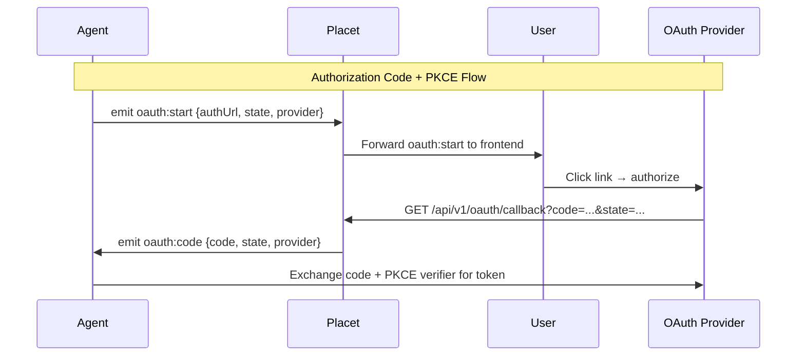
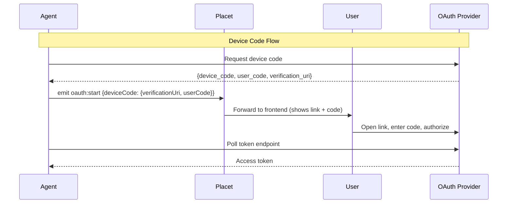

<Warning>
  This feature is **experimental** and may change without notice in future releases.
</Warning>

Placet can act as an OAuth relay, allowing connected agents to initiate OAuth authorization flows that involve the end user — without the agent needing direct browser access.

This is useful when an agent needs the user to authorize a third-party service (e.g., GitHub, Google, Slack) and the agent runs headlessly behind Placet.

## Supported Flows

### Authorization Code + PKCE

The agent generates a PKCE challenge and constructs the authorization URL with Placet's callback as the `redirect_uri`. The user clicks the link in the Placet UI, authorizes the app, and the OAuth provider redirects back to Placet. Placet then relays the authorization code to the agent via Socket.IO.

**Security:** The PKCE verifier never leaves the agent. Placet only sees the authorization code (which is useless without the verifier).

### Device Code

The agent initiates a device code flow with the OAuth provider and sends the verification URL + user code to the user via Placet. The user opens the URL and enters the code. The agent polls the token endpoint directly.

## How It Works





## Callback URL

The OAuth callback endpoint is:

```
{PLACET_URL}/api/v1/oauth/callback
```

Use this as the `redirect_uri` when constructing authorization URLs for the Authorization Code flow.

## Socket.IO Events

### `oauth:start` (agent → server)

Emitted by the agent to initiate an OAuth flow. The server registers the state for callback resolution and forwards the event to the user's frontend.

```typescript
socket.emit('oauth:start', {
  channelId: 'your-agent-id',
  state: 'random-state-string',
  provider: 'github',
  // For Authorization Code flow:
  authUrl: 'https://github.com/login/oauth/authorize?...',
  // For Device Code flow:
  deviceCode: {
    verificationUri: 'https://github.com/login/device',
    userCode: 'ABCD-1234',
    expiresIn: 900,
  },
});
```

| Field                        | Type   | Required | Description                             |
| ---------------------------- | ------ | -------- | --------------------------------------- |
| `channelId`                  | string | Yes      | The agent's channel ID                  |
| `state`                      | string | Yes      | Unique state parameter for this flow    |
| `provider`                   | string | Yes      | Name of the OAuth provider              |
| `authUrl`                    | string | No       | Full authorization URL (Auth Code flow) |
| `deviceCode`                 | object | No       | Device code details (Device Code flow)  |
| `deviceCode.verificationUri` | string | Yes\*    | URL for the user to visit               |
| `deviceCode.userCode`        | string | Yes\*    | Code for the user to enter              |
| `deviceCode.expiresIn`       | number | No       | Seconds until the device code expires   |

### `oauth:code` (server → agent)

Emitted to the agent's channel when the OAuth callback receives an authorization code.

```json
{
  "state": "random-state-string",
  "code": "the-authorization-code",
  "provider": "github"
}
```

### `oauth:error` (server → agent)

Emitted when the OAuth provider returns an error to the callback.

```json
{
  "state": "random-state-string",
  "error": "access_denied",
  "errorDescription": "The user denied the request",
  "provider": "github"
}
```

### `oauth:start` (server → frontend)

Forwarded to the user's frontend session to display the authorization link or device code.

```json
{
  "channelId": "your-agent-id",
  "state": "random-state-string",
  "provider": "github",
  "authUrl": "https://github.com/login/oauth/authorize?...",
  "deviceCode": null
}
```

## State Management

- Each `oauth:start` event registers the `state` parameter in an in-memory store with a **10-minute TTL**.
- The state is consumed (single-use) when the callback arrives.
- Expired or unknown states return an error page to the user.

## Example: Agent Integration (TypeScript)

```typescript
import { io } from 'socket.io-client';
import crypto from 'crypto';

const socket = io('https://your-placet.com/ws', {
  auth: { apiKey: 'hp_your-key' },
  transports: ['websocket'],
});

// Generate PKCE
const verifier = crypto.randomBytes(32).toString('base64url');
const challenge = crypto.createHash('sha256').update(verifier).digest('base64url');

const state = crypto.randomBytes(16).toString('hex');

const authUrl = new URL('https://github.com/login/oauth/authorize');
authUrl.searchParams.set('client_id', 'your-client-id');
authUrl.searchParams.set('redirect_uri', 'https://your-placet.com/api/v1/oauth/callback');
authUrl.searchParams.set('state', state);
authUrl.searchParams.set('code_challenge', challenge);
authUrl.searchParams.set('code_challenge_method', 'S256');
authUrl.searchParams.set('scope', 'read:user');

socket.emit('subscribe:channel', 'your-agent-id');
socket.emit('oauth:start', {
  channelId: 'your-agent-id',
  state,
  provider: 'github',
  authUrl: authUrl.toString(),
});

socket.on('oauth:code', async (data) => {
  if (data.state !== state) return; // ignore unrelated flows

  // Exchange code for token using PKCE verifier
  const tokenResponse = await fetch('https://github.com/login/oauth/access_token', {
    method: 'POST',
    headers: { Accept: 'application/json', 'Content-Type': 'application/json' },
    body: JSON.stringify({
      client_id: 'your-client-id',
      code: data.code,
      code_verifier: verifier,
    }),
  });

  const { access_token } = await tokenResponse.json();
  console.log('Got token:', access_token);
});
```
