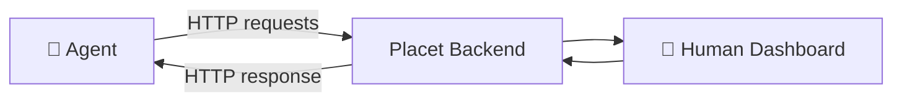
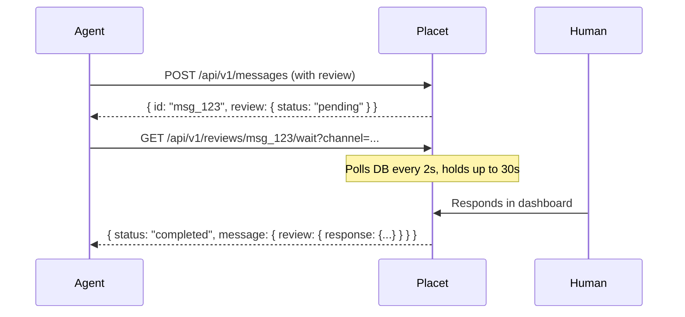

The REST API is the most straightforward way to integrate with Placet. Send HTTP requests to create messages, request human reviews, and poll for responses. Works from any language, any environment — no persistent connections or public endpoints required.

This is the recommended connection type for **scripts, CLI tools, serverless functions**, and any agent that runs as a short-lived process.



## Authentication

All API requests require an API key passed in the `x-api-key` header:

```bash
curl -H "x-api-key: hp_your-api-key" \
  https://your-placet-instance.com/api/v1/agents
```

API keys are created in the Placet dashboard under **Settings > API Keys**. They always start with `hp_`.

---

## Sending Messages

### Informational Messages

Send status updates, logs, reports, or any content that doesn't require a response. Messages support full markdown.

```bash
curl -X POST "$PLACET_URL/api/v1/messages" \
  -H "x-api-key: $API_KEY" \
  -H "Content-Type: application/json" \
  -d '{
    "channelId": "your-agent-id",
    "text": "## Build Complete\n\nAll **47 tests** passed in 2.3s.",
    "status": "success",
    "metadata": { "buildId": "build-123", "duration": 2.3 }
  }'
```

**Status indicators**: `info` (blue), `success` (green), `warning` (yellow), `error` (red)

### Messages with Reviews

Send a message that requires human interaction:

```bash
curl -X POST "$PLACET_URL/api/v1/messages" \
  -H "x-api-key: $API_KEY" \
  -H "Content-Type: application/json" \
  -d '{
    "channelId": "your-agent-id",
    "text": "Deploy to production?",
    "review": {
      "type": "approval",
      "payload": {
        "options": [
          { "id": "approve", "label": "Approve", "style": "primary" },
          { "id": "reject", "label": "Reject", "style": "danger" }
        ],
        "allowComment": true
      },
      "expiresInSeconds": 3600
    }
  }'
```

See [Review Types](/concepts/agents#review-types) for all available review types and their payloads.

---

## Streaming Replies

For agents that produce a reply token-by-token, Placet supports a draft-then-update model:

1. **Start the draft** — `POST /api/v1/messages` with `streamId` (a stable id for this turn), `streamState: "streaming"`, and the partial `text` so far. The response contains the persisted message id.
2. **Append updates** — `PATCH /api/v1/messages/streams/:streamId` with the latest accumulated `text` whenever new tokens arrive. Throttle these to a few per second; the WebSocket `message:delta` event drives instant UI updates between PATCH calls.
3. **Finalise** — `PATCH /api/v1/messages/streams/:streamId` with the final `text` and `complete: true`. The frontend stops treating the row as a live draft and pins it back into chronological order.

The `(channelId, streamId)` pair is unique, so the first POST is idempotent: a retried POST returns the existing draft rather than creating a duplicate row. Refreshing the chat mid-stream redisplays whatever has been PATCHed so far — the streamed reply never disappears on reload.

---

## Long-Polling

The simplest way to wait for a human response. Your agent sends a request and blocks until the human responds (or the poll times out).



### Usage

```bash
# 1. Send a message with a review
RESPONSE=$(curl -s -X POST "$PLACET_URL/api/v1/messages" \
  -H "x-api-key: $API_KEY" \
  -H "Content-Type: application/json" \
  -d '{
    "channelId": "your-agent-id",
    "text": "Continue processing?",
    "review": {
      "type": "approval",
      "payload": {
        "options": [
          { "id": "yes", "label": "Yes" },
          { "id": "no", "label": "No" }
        ]
      }
    }
  }')

MESSAGE_ID=$(echo "$RESPONSE" | jq -r '.id')

# 2. Long-poll for the response (repeat until completed or expired)
while true; do
  RESULT=$(curl -s "$PLACET_URL/api/v1/reviews/$MESSAGE_ID/wait?channel=your-agent-id&timeout=30000" \
    -H "x-api-key: $API_KEY")

  STATUS=$(echo "$RESULT" | jq -r '.status')

  if [ "$STATUS" = "completed" ]; then
    echo "Response: $(echo "$RESULT" | jq '.message.review.response')"
    break
  elif [ "$STATUS" = "expired" ]; then
    echo "Review expired"
    break
  elif [ "$STATUS" = "timeout" ]; then
    : # poll again
  fi
done
```

### Parameters

| Parameter | Default      | Description                            |
| --------- | ------------ | -------------------------------------- |
| `channel` | _(required)_ | Agent/channel ID                       |
| `timeout` | `30000`      | Max wait time in ms (capped at 30,000) |

### Response States

| `status`    | Meaning                                                         |
| ----------- | --------------------------------------------------------------- |
| `completed` | Human responded — `message.review.response` contains the answer |
| `timeout`   | Timeout reached, no response yet — call again to keep waiting   |
| `expired`   | Review expired (default 24h) — no response will come            |

<Tip>
  A single poll waits up to 30 seconds. For reviews that may take minutes or hours, simply loop the
  poll call. The review stays active until the human responds or it expires.
</Tip>

---

## Python Example

```python
import requests
import time

PLACET_URL = "http://localhost:3001"
API_KEY = "hp_your-api-key"
CHANNEL_ID = "your-agent-id"

headers = {
    "x-api-key": API_KEY,
    "Content-Type": "application/json",
}

# Send a form review
msg = requests.post(f"{PLACET_URL}/api/v1/messages", headers=headers, json={
    "channelId": CHANNEL_ID,
    "text": "Please configure the deployment:",
    "review": {
        "type": "form",
        "payload": {
            "fields": [
                {"name": "env", "type": "select", "label": "Environment", "required": True,
                 "options": [
                     {"value": "staging", "label": "Staging"},
                     {"value": "production", "label": "Production"},
                 ]},
                {"name": "instances", "type": "number", "label": "Instances", "min": 1, "max": 10},
            ],
            "submitLabel": "Deploy",
        },
    },
}).json()

# Poll for the response
while True:
    result = requests.get(
        f"{PLACET_URL}/api/v1/reviews/{msg['id']}/wait",
        headers={"x-api-key": API_KEY},
        params={"channel": CHANNEL_ID, "timeout": 30000},
    ).json()

    status = result.get("status")
    if status == "completed":
        response = result["message"]["review"]["response"]
        print(f"Deploy to {response['env']} with {response['instances']} instances")
        break
    elif status == "expired":
        print("Review expired")
        break
    # Still pending — poll again
```

---

## TypeScript Example

```typescript
const PLACET_URL = 'http://localhost:3001';
const API_KEY = 'hp_your-api-key';
const CHANNEL_ID = 'your-agent-id';

const headers = {
  'x-api-key': API_KEY,
  'Content-Type': 'application/json',
};

// Send a selection review
const msg = await fetch(`${PLACET_URL}/api/v1/messages`, {
  method: 'POST',
  headers,
  body: JSON.stringify({
    channelId: CHANNEL_ID,
    text: 'Which database migration should we run?',
    review: {
      type: 'selection',
      payload: {
        mode: 'single',
        items: [
          { id: 'migrate-up', label: 'Run pending migrations' },
          { id: 'migrate-down', label: 'Rollback last migration' },
          { id: 'skip', label: 'Skip — no changes needed' },
        ],
      },
    },
  }),
}).then((r) => r.json());

// Poll for the response
while (true) {
  const result = await fetch(
    `${PLACET_URL}/api/v1/reviews/${msg.id}/wait?channel=${CHANNEL_ID}&timeout=30000`,
    { headers: { 'x-api-key': API_KEY } },
  ).then((r) => r.json());

  if (result.status === 'completed') {
    console.log('Selected:', result.message.review.response.selectedIds);
    break;
  }
  if (result.status === 'expired') {
    console.log('Review expired');
    break;
  }
}
```

---

## Delivery Acknowledgment

Acknowledge that your agent received and processed a message. This updates the delivery status shown in the Placet dashboard (WhatsApp-style checkmarks).

```bash
curl -X POST "$PLACET_URL/api/v1/messages/$MESSAGE_ID/ack?channel=$CHANNEL_ID" \
  -H "x-api-key: $API_KEY"
```

| Status              | Icon      | Meaning                    |
| ------------------- | --------- | -------------------------- |
| `sent`              | ✓         | Message stored             |
| `webhook_delivered` | ✓✓        | Webhook received 2xx       |
| `webhook_failed`    | ✓ ❌      | Webhook delivery failed    |
| `agent_received`    | ✓✓ (blue) | Agent acknowledged receipt |

---

## API Endpoints

For the full API reference with request/response schemas, see the [REST API Reference](/api-reference).

| Method   | Endpoint                             | Description                               |
| -------- | ------------------------------------ | ----------------------------------------- |
| `POST`   | `/api/v1/messages`                   | Send a message (with optional review)     |
| `PATCH`  | `/api/v1/messages/streams/:streamId` | Update a streaming draft (text, complete) |
| `GET`    | `/api/v1/messages`                   | List messages (paginated, searchable)     |
| `GET`    | `/api/v1/messages/:id`               | Get a single message                      |
| `DELETE` | `/api/v1/messages/:id`               | Delete (retract) a message                |
| `POST`   | `/api/v1/messages/:id/ack`           | Acknowledge receipt                       |
| `GET`    | `/api/v1/reviews/pending`            | List pending reviews                      |
| `GET`    | `/api/v1/reviews/:id`                | Get review by message ID                  |
| `GET`    | `/api/v1/reviews/:id/wait`           | Long-poll for review response             |
| `GET`    | `/api/v1/agents`                     | List channels                             |
| `POST`   | `/api/v1/agents`                     | Create a channel                          |
| `POST`   | `/api/v1/status/ping`                | Report agent heartbeat                    |
| `GET`    | `/api/v1/plugins`                    | List installed plugins                    |
| `GET`    | `/api/v1/plugins/:name`              | Get plugin details                        |
| `POST`   | `/api/v1/files/upload`               | Upload a file                             |
| `POST`   | `/api/v1/files/store`                | Store a file for later attachment         |
| `GET`    | `/api/v1/files/:id/download`         | Download a file                           |
