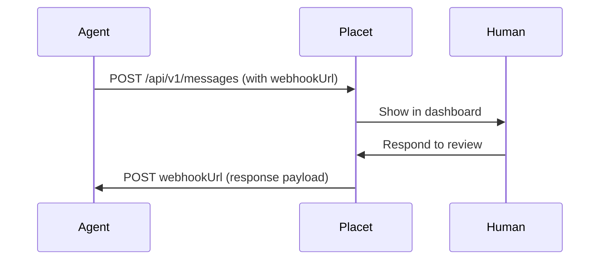

Webhooks let Placet push review responses to your server via HTTP callbacks. Your agent sends a message with a review and a `webhookUrl`, and Placet POSTs the response to that URL when a human responds.

This is the recommended connection type for **background automations, CI/CD pipelines, and serverless functions** that can't maintain persistent connections.



## When to Use Webhooks

- Your agent runs as a **background service** or **serverless function**
- You don't want to hold a connection open waiting for a response
- Your agent has a **publicly accessible HTTP endpoint**
- You need **fire-and-forget** with async response handling

If your agent can't expose a public endpoint, use [Long-Polling](/connections/rest-api#long-polling) or [MCP](/connections/mcp) instead.

---

## Setting a Webhook URL

Webhook URLs can be set at three levels, in order of priority:

### 1. Per-message (highest priority)

Set `webhookUrl` directly on the message:

```bash
curl -X POST "$PLACET_URL/api/v1/messages" \
  -H "x-api-key: $API_KEY" \
  -H "Content-Type: application/json" \
  -d '{
    "channelId": "your-agent-id",
    "text": "Approve deployment to production?",
    "webhookUrl": "https://your-server.com/webhook/deploy",
    "review": {
      "type": "approval",
      "payload": {
        "options": [
          { "id": "approve", "label": "Approve", "style": "primary" },
          { "id": "reject", "label": "Reject", "style": "danger" }
        ]
      }
    }
  }'
```

### 2. Per-channel (default for all messages)

Configure a default webhook URL on the channel/agent in the dashboard under **Settings > Channels**. This URL is used for all messages in that channel unless overridden by a per-message URL.

### 3. Legacy callback (lowest priority)

Set `review.callback` on the review object:

```json
{
  "review": {
    "type": "approval",
    "payload": { "options": [{ "id": "ok", "label": "OK" }] },
    "callback": {
      "url": "https://your-server.com/webhook",
      "method": "POST",
      "headers": { "X-Custom-Header": "value" }
    }
  }
}
```

<Note>
  The first matching webhook URL wins. If a message has `webhookUrl`, the channel-level and callback
  URLs are ignored.
</Note>

---

## Webhook Payload

When a human responds, Placet POSTs a JSON payload to your webhook URL:

```json
{
  "event": "review:responded",
  "channelId": "clxyz456",
  "message_id": "clxyz111",
  "review_type": "approval",
  "response": {
    "selectedOption": "approve",
    "comment": "Looks good, ship it!"
  },
  "responded_at": "2026-04-01T14:32:00.000Z"
}
```

The `response` shape depends on the review type:

| Review Type  | Response Fields                        |
| ------------ | -------------------------------------- |
| `approval`   | `selectedOption`, `comment?`           |
| `selection`  | `selectedIds` (string array)           |
| `form`       | Key-value pairs matching field `name`s |
| `text-input` | `text` (string)                        |
| `freeform`   | Arbitrary key-value pairs              |

---

## Webhook Server Example

A minimal Express.js server that handles webhook callbacks:

```typescript
import express from 'express';

const app = express();
app.use(express.json());

app.post('/webhook/deploy', (req, res) => {
  const { event, response, message_id } = req.body;

  if (event === 'review:responded') {
    const { selectedOption, comment } = response;
    console.log(`Deployment ${selectedOption} (message: ${message_id})`);
    if (comment) console.log(`Comment: ${comment}`);

    if (selectedOption === 'approve') {
      // Trigger deployment pipeline
      triggerDeploy();
    }
  }

  res.sendStatus(200);
});

app.listen(8080, () => {
  console.log('Webhook server running on :8080');
});
```

---

## Delivery Status

Placet tracks webhook delivery and exposes the status in the dashboard:

| Status              | Meaning                                          |
| ------------------- | ------------------------------------------------ |
| `sent`              | Message stored, webhook not yet sent             |
| `webhook_delivered` | Your endpoint returned 2xx                       |
| `webhook_failed`    | Your endpoint returned non-2xx or timed out      |
| `agent_received`    | Agent explicitly acknowledged (via ACK endpoint) |

### Retrying Failed Deliveries

When a webhook delivery fails, users can retry from the dashboard UI. The retry re-sends the original payload.

---

## Security

### SSRF Protection

Placet validates all webhook URLs and blocks requests to private/internal IP ranges to prevent SSRF attacks:

- `10.0.0.0/8`
- `172.16.0.0/12`
- `192.168.0.0/16`
- `127.0.0.0/8`
- `::1`, `fd00::/8`

<Warning>
  Your webhook endpoint **must be publicly accessible**. Placet will reject requests to private IP
  addresses and localhost URLs.
</Warning>

### Timeouts

Webhook requests have a **10-second timeout**. If your endpoint doesn't respond within 10 seconds, the delivery is marked as `webhook_failed`.

### Recommendations

- Return `200 OK` as quickly as possible — process the payload asynchronously
- Implement idempotency using the `message.id` field to handle retries
- Validate the payload structure before processing
- Use HTTPS for your webhook endpoint in production
