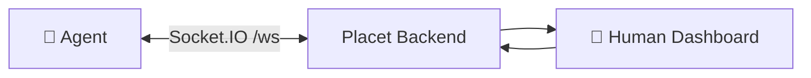

WebSocket provides real-time, bidirectional communication between your agent and Placet. Built on [Socket.IO](https://socket.io/), it delivers instant push notifications when humans respond to reviews, send messages, or when delivery status changes.

This is the recommended connection type for **interactive agents** that need to react immediately to human input and maintain a persistent connection.



## When to Use WebSocket

- Your agent runs **continuously** (server process, daemon, long-running script)
- You need **real-time** responses (sub-second latency)
- Your agent handles **multiple channels** simultaneously
- You want **bidirectional** communication (send + receive)

For short-lived scripts or serverless functions, consider [Long-Polling](/connections/rest-api#long-polling) or [Webhooks](/connections/webhooks) instead.

---

## Authentication

Agents authenticate by passing their API key in the Socket.IO `auth` object:

```typescript
import { io } from 'socket.io-client';

const socket = io('https://your-placet-instance.com/ws', {
  auth: { apiKey: 'hp_your-api-key' },
  transports: ['websocket'],
});
```

```python
import socketio

sio = socketio.Client()
sio.connect(
    "https://your-placet-instance.com",
    namespaces=["/ws"],
    auth={"apiKey": "hp_your-api-key"},
    transports=["websocket"],
)
```

The server validates the API key on connection. Invalid or missing keys result in an immediate disconnect.

<Note>
  The frontend dashboard uses a different auth method: a short-lived JWT ticket obtained via `POST
  /api/auth/ws-ticket`. This is handled automatically by the Placet frontend.
</Note>

---

## Channel Subscription

After connecting, subscribe to channels to receive their events:

```typescript
socket.on('connect', () => {
  // Subscribe to one or more channels
  socket.emit('subscribe:channel', 'your-agent-id');
  socket.emit('subscribe:channel', 'another-agent-id');
});

// Unsubscribe when no longer needed
socket.emit('unsubscribe:channel', 'your-agent-id');
```

<Warning>
  The server verifies that the API key has access to the channel. Subscribing to a channel your API
  key doesn't own will silently fail.
</Warning>

---

## Events

All events are received on the `/ws` namespace.

### `message:created`

A new message was posted in a subscribed channel.

```json
{
  "id": "clxyz111",
  "channelId": "clxyz456",
  "senderType": "user",
  "senderId": "user_abc",
  "text": "Looks good, ship it!",
  "status": null,
  "review": null,
  "metadata": null,
  "createdAt": "2026-04-01T14:30:00.000Z",
  "attachments": []
}
```

### `message:updated`

An existing message row changed — most commonly because an agent PATCHed the
draft of a streaming reply (see [Streaming Replies](/connections/rest-api#streaming-replies)).
The full updated message record is emitted; clients should replace the row by
`id` in place. Messages with `streamState === "streaming"` are still live drafts;
once `streamState` flips to `"complete"` the reply is final.

### `message:delta`

A streaming agent reply produced a new chunk. Used for low-latency UI updates
between the slower PATCH-driven `message:updated` events. Match deltas to the
draft row by `streamBaseId` (which equals the row's `streamId` column).

```json
{
  "channelId": "clxyz456",
  "delta": " more tokens",
  "streamBaseId": "stream-abc",
  "streamId": "stream-abc:2",
  "streamStartedAt": "2026-04-01T14:30:00.000Z"
}
```

### `review:responded`

A human completed a review (approval, selection, form, etc.). The full message record is emitted, including attachments.

```json
{
  "id": "clxyz111",
  "channelId": "clxyz456",
  "senderType": "agent",
  "senderId": "clxyz456",
  "text": "Deploy to production?",
  "status": null,
  "review": {
    "type": "approval",
    "status": "completed",
    "payload": {
      "options": [
        { "id": "approve", "label": "Approve", "style": "primary" },
        { "id": "reject", "label": "Reject", "style": "danger" }
      ]
    },
    "response": {
      "selectedOption": "approve",
      "comment": "Go ahead"
    },
    "completed_at": "2026-04-01T14:32:00.000Z"
  },
  "metadata": null,
  "createdAt": "2026-04-01T14:30:00.000Z",
  "attachments": []
}
```

The `review.response` shape depends on the review type:

| Review Type  | Response Fields                        |
| ------------ | -------------------------------------- |
| `approval`   | `selectedOption`, `comment?`           |
| `selection`  | `selectedIds` (string array)           |
| `form`       | Key-value pairs matching field `name`s |
| `text-input` | `text` (string)                        |
| `freeform`   | Arbitrary key-value pairs              |

### `review:expired`

A review expired without a human response (default: 24 hours).

```json
{
  "messageId": "clxyz111"
}
```

### `message:delivery`

A message's delivery status changed.

```json
{
  "messageId": "clxyz111",
  "deliveryStatus": "agent_received"
}
```

| Status              | Meaning                              |
| ------------------- | ------------------------------------ |
| `sent`              | Message stored, webhook not yet sent |
| `webhook_delivered` | Webhook received 2xx response        |
| `webhook_failed`    | Webhook delivery failed              |
| `agent_received`    | Agent acknowledged receipt           |

### `agent:status`

An agent's heartbeat status changed.

```json
{
  "agentId": "clxyz456",
  "status": "active",
  "statusMessage": "Processing batch job",
  "statusSince": "2026-04-01T14:00:00.000Z"
}
```

### `ping` / `pong`

Send a `ping` event to check the connection is alive. The server responds with `pong`.

```typescript
socket.emit('ping');
socket.on('pong', () => console.log('Connection alive'));
```

---

## Full Example

A complete agent that sends a deployment approval request and waits for the response via WebSocket:

```typescript
import { io } from 'socket.io-client';

const PLACET_URL = 'https://your-placet-instance.com';
const API_KEY = 'hp_your-api-key';
const CHANNEL_ID = 'your-agent-id';

// 1. Connect via WebSocket
const socket = io(`${PLACET_URL}/ws`, {
  auth: { apiKey: API_KEY },
  transports: ['websocket'],
});

socket.on('connect', () => {
  console.log('Connected to Placet');
  socket.emit('subscribe:channel', CHANNEL_ID);

  // 2. Send a deployment approval request
  sendApproval();
});

// 3. Listen for the review response
socket.on('review:responded', (data) => {
  const { selectedOption, comment } = data.review.response;
  console.log(`Decision: ${selectedOption}`);
  if (comment) console.log(`Comment: ${comment}`);

  if (selectedOption === 'approve') {
    console.log('Deploying...');
    // Trigger deployment
  } else {
    console.log('Deployment cancelled');
  }
});

socket.on('review:expired', (data) => {
  console.log(`Review ${data.messageId} expired — no response received`);
});

async function sendApproval() {
  const res = await fetch(`${PLACET_URL}/api/v1/messages`, {
    method: 'POST',
    headers: {
      'x-api-key': API_KEY,
      'Content-Type': 'application/json',
    },
    body: JSON.stringify({
      channelId: CHANNEL_ID,
      text: '### Deploy v2.1.0 to production?',
      review: {
        type: 'approval',
        payload: {
          options: [
            { id: 'approve', label: 'Approve', style: 'primary' },
            { id: 'reject', label: 'Reject', style: 'danger' },
          ],
          allowComment: true,
        },
      },
    }),
  });
  const message = await res.json();
  console.log(`Approval sent: ${message.id}`);
}
```

---

## Reconnection

Socket.IO handles reconnection automatically. Placet uses the default Socket.IO reconnection settings:

- Reconnects automatically on disconnect
- Exponential backoff (1s, 2s, 4s, ...)
- Re-authenticates on reconnect

<Tip>
  After reconnecting, re-subscribe to your channels — Socket.IO does not persist subscriptions
  across reconnects. Listen for the `connect` event and emit `subscribe:channel` again.
</Tip>
