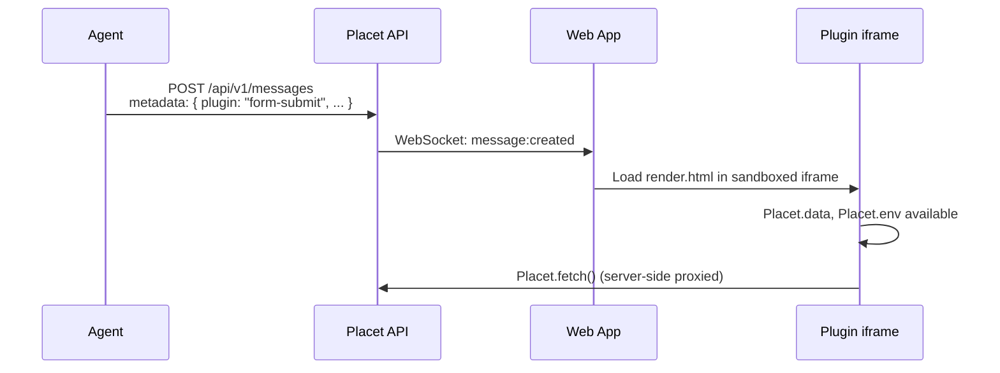

## What is a Plugin?

A **Plugin** defines a **custom message type**. It controls:

1. **What data a message carries** via an input schema (what fields the agent sends)
2. **How that message renders** as HTML/CSS/JS in a sandboxed iframe
3. **What logic runs client-side** such as HTTP requests, data fetching, user interactions
4. **What configuration it needs** like environment variables (API keys, URLs, etc.)

A Plugin does **NOT** control:

- Whether a message requires a review/response (that's the agent's decision per message)
- The approve/reject buttons (that's the review system, orthogonal to plugins)
- Authentication or routing (that's the platform)

### Plugin vs Review

These are **two independent axes** on a message:

```
Message
  ├── metadata.plugin: "form-submit"    ← HOW the message renders (Plugin)
  ├── review: { ... }                   ← WHETHER user input is needed (Review)
  │     ├── type: "approval"            ← WHAT kind of input
  │     └── payload: { options: [...] }
  └── metadata: { name: "John", ... }   ← Plugin-specific data
```

## Plugin Structure

Each plugin lives in `packages/plugins/<name>/` and consists of:

- [**plugin.json**](/plugins/creating-plugins#manifest-reference): Manifest with metadata, input schema, env variables, and permissions
- [**render.html**](/plugins/creating-plugins#create-renderhtml): HTML + CSS + JS rendered inside a sandboxed iframe
- **icon.svg/.png** (optional): Icon shown in the Settings UI

<Note>
  Plugins are discovered automatically on backend startup. No build step required, just add the
  directory and restart.
</Note>

## Built-in Plugins

Placet ships with two example plugins you can use as reference:

| Plugin            | Description                                                                      | Source                                                                                                            |
| ----------------- | -------------------------------------------------------------------------------- | ----------------------------------------------------------------------------------------------------------------- |
| **Form Submit**   | Renders a form from structured data and submits it to a configurable webhook URL | [`packages/plugins/form-submit/`](https://github.com/placet-io/placet/tree/main/packages/plugins/form-submit)     |
| **Kroki Diagram** | Renders diagrams (Mermaid, PlantUML, D2, etc.) via a Kroki server                | [`packages/plugins/kroki-diagram/`](https://github.com/placet-io/placet/tree/main/packages/plugins/kroki-diagram) |

## Data Flow



## Security Model

| Concern              | Solution                                                                     |
| -------------------- | ---------------------------------------------------------------------------- |
| **DOM access**       | `sandbox="allow-scripts"` only, no `allow-same-origin`, no parent DOM access |
| **Cookies/Storage**  | Sandboxed iframe has no access to parent cookies or localStorage             |
| **HTTP requests**    | Server-side proxied; domain allowlist enforced via `maxHttpDomains`          |
| **Script injection** | Plugin HTML is static per-plugin, loaded from disk                           |
| **Env values**       | Stored in DB, injected at render time; secrets not exposed in manifest       |

## Available in Plugins

Inside the iframe, plugins access the [Bridge API](/plugins/bridge-api) via the `Placet` global:

| Property             | Type                      | Description                                                    |
| -------------------- | ------------------------- | -------------------------------------------------------------- |
| `Placet.data`        | `Record<string, unknown>` | Plugin input data from the message metadata                    |
| `Placet.env`         | `Record<string, string>`  | Environment variables configured in Settings                   |
| `Placet.attachments` | `AttachmentInfo[]`        | Array of attached files (`{ id, filename, mimeType, size }`)   |
| `Placet.message`     | `MessageContext`          | Message context (`id`, `channelId`, `senderType`, `createdAt`) |
| `Placet.theme`       | `'light' \| 'dark'`       | Current theme                                                  |
| `Placet.review`      | `ReviewContext \| null`   | Review context (`{ type, status, payload }`) or `null`         |
| `Placet.isPreview`   | `boolean`                 | `true` when rendered in the full-screen preview modal          |

Methods: `Placet.fetch()`, `Placet.getFile()`, `Placet.getFileUrl()`, `Placet.toast()`, `Placet.respond()`, `Placet.resize()`, `Placet.emit()`, `Placet.on()`. See the full [Bridge API reference](/plugins/bridge-api) for details.
